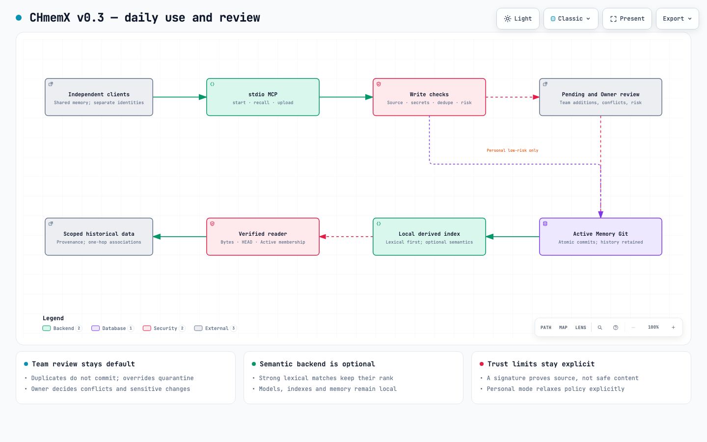

# CHmemX

**English** | [简体中文](README.zh-CN.md)

[](https://github.com/juliansoul250/CHmemX/actions/workflows/test.yml)
[](LICENSE)
[](pyproject.toml)

**A local-first, Git-backed shared memory graph for multiple AI agents.**

CHmemX gives Claude Code, Codex, OpenCode, Pi, ZCode, or another tool separate upload entrances
while keeping one curated, content-first memory project for everyone to read.

In the default team mode, source agents query accepted memory and upload pending packages. They cannot promote
uploads directly. A central curator validates provenance, removes exact duplicates, compares
incoming content with current Active memory, prepares conflict diffs, assigns content/project grid
nodes, requests owner approval, and commits permanent memory atomically to Git.

> CHmemX is designed to prevent normal workflow mistakes and memory conflicts. It is not an OS
> security boundary against a malicious process running as the same user.

## Start with v0.5.2

CHmemX now exposes three stdio MCP tools: `start`, `recall`, and `upload`.
No server port, database service, API key, or embedding download is required for the default setup.

```bash
python3 -m venv .venv
.venv/bin/python -m pip install 'git+https://github.com/juliansoul250/CHmemX.git@v0.5.2'
.venv/bin/chmemx --store /absolute/private-memory --cwd /absolute/git-project \
  --agent-id codex-main init --project-id project-demo
```

Use an existing Git project and a new, separate memory directory. Add the
[stdio client configuration](docs/mcp.md), then call `start` at task start and `upload` at task end.
The index is rebuilt lazily after approved commits; source agents do not manage index files.

### Choose a write policy

| Decision | Team (default) | Personal (explicit `init --mode personal`) |
|---|---|---|
| Who prepares memory? | Source agents upload Pending; the curator reviews. | Same upload checks; only configured sources qualify for automatic saving. |
| What can be saved automatically? | No new Active memory. | Low-risk new `preference.*` preferences, except a deterministic 10% review sample by default. |
| What always needs review? | Every new or replacement batch, with exact Owner confirmation. | Conflicts, replacements, other facts and high-risk content; reviewed batches use exact Owner confirmation. |
| Exact duplicates | No new Active record or Git commit. | Same. |
| Evidence and recall | Git approval history; Pending and quarantine never recalled. | Same, with automatic policy decisions recorded. |
| Upgrade behavior | Existing policy stays unchanged. | Never enabled by upgrading. |

Personal mode deliberately relaxes the write policy. It is useful for one person's routine
preferences, not a substitute for Team review. Agent names identify workflow sources; optional
signatures establish key provenance, not truth or OS-level authorization. Neither mode prevents
a malicious process with the same user's filesystem access from editing the store.

- [MCP configuration and tool arguments](docs/mcp.md)
- [v0.5.2 registration, review and source-validity fixes](docs/v0.5.2.md)
- [v0.5.1 recovery fixes and upgrade notes](docs/v0.5.1.md)
- [v0.5 upload lifecycle and upgrade notes](docs/v0.5.md)
- [Queue maintenance and recovery](docs/maintenance.md)
- [v0.3 design decisions, limits, and measured results](docs/v0.3.md)
- [Optional local semantic retrieval](docs/semantic.md)
- [Ordered backlog and acceptance gates](BACKLOG.md)

## Why CHmemX?

Agent-specific memory folders become silos. Switching tools often means losing previous decisions,
repeating research, or applying contradictory summaries. Letting every tool write directly into one
store creates the opposite problem: unreviewed, duplicated, conflicting memory.

CHmemX separates the responsibilities:

- **Source agents** read shared Active memory and upload source-owned pending packages.
- **The curator** validates, deduplicates, compares, organizes, and recommends.
- **The owner** decides conflicts and confirms exact batches.
- **Git** preserves the permanent record, approvals, supersession chain, and rollback history.
- **The vector pointer** routes natural-language topics into content grids and linked Active nodes.

## Architecture

[](docs/v03-en.html)

Open the [v0.3 interactive map](docs/v03-en.html). The [earlier full team pipeline](docs/architecture.html)
is retained as versioned design history. See [v0.5](docs/v0.5.md) for the lifecycle and
[v0.5.2](docs/v0.5.2.md) for the latest fixes.

## Key properties

- One current Active value per `(project, scope, class, canonical key)` identity.
- Global preferences and registered project memory remain explicitly labeled.
- Tool identity is upload provenance, not read ownership.
- Uploads, candidates, quarantine, rejected content, and unresolved conflicts are never recalled.
- Exact owner confirmation binds batch ID, digest, candidate order, bodies, sources, and Git HEAD.
- Supersede and Git revert preserve history; records are not silently overwritten.
- The derived vector index contains no record bodies and fails closed when its Git HEAD is stale.
- English and Chinese routing work offline without downloading an embedding model.
- Runtime code uses only Python's standard library and Git.

## Advanced team workflow (existing CLI remains supported)

The following commands use the legacy v1/v2 pointer. New integrations should use the MCP tools
or `chmemx recall`, which run v3 retrieval and project-source validity checks. Keep the two index
formats separate; running the legacy optimizer does not optimize the MCP index.

### 1. Read shared memory

Every task starts with scoped lookup:

```bash
python3 "$MEMORY_GRAPH_KIT/runtime/simple_memory.py" \
  --cwd "$PWD" start --role main --query '3 to 8 task keywords'
```

Then query the content-first graph:

```bash
python3 "$MEMORY_GRAPH_KIT/scripts/vector_memory.py" recall \
  --index "$MEMORY_GRAPH_KIT/vector-index.json" \
  --cwd "$PWD" \
  --query 'the current topic in natural language'
```

Only `authority=accepted` and `status=active` records may influence work. Project source and official
documentation still outrank memory.

### 2. Upload source-owned pending memory

At task end, a source agent writes one `memorygraph-agent-export-v1` JSON package using the schema
and example:

```text
inbox/<agent-id>/<export-id>.json
```

The source agent reports the path, item count, rejected count, and SHA-256, then stops. It does not
assemble, curate, import, review, approve, supersede, revert, or write directly to the memory Git
repository.

### 3. Route and curate uploads

The curator can inspect routing suggestions without changing the store:

```bash
python3 "$MEMORY_GRAPH_KIT/scripts/vector_memory.py" route-upload \
  --index "$MEMORY_GRAPH_KIT/vector-index.json" \
  --export "inbox/<agent-id>/<export-id>.json"
```

Then combine uploads belonging to one scope and at most one project root:

```bash
python3 "$MEMORY_GRAPH_KIT/scripts/curate_uploads.py" \
  --export "inbox/agent-a/export-a.json" \
  --export "inbox/agent-b/export-b.json" \
  --curator-agent-id main-memory-curator \
  --curation-id curation-example \
  --output "outbox/curation-example.inventory.json" \
  --report "outbox/curation-example.report.json"
```

The report:

- preserves source Agent IDs and export IDs;
- collapses exact duplicates;
- blocks same-identity disagreements;
- compares incoming candidates with current Active memory;
- includes current/incoming bodies, sources, field differences, and unified body diff for conflicts;
- marks semantic overlap for manual review;
- never modifies the canonical store.

### 4. Resolve conflicts

The curator gives the owner four explicit options:

- keep current Active;
- supersede with incoming;
- rewrite one merged candidate;
- keep separate keys and connect their routing nodes.

Conflict resolution authorizes preparation only. Final memory still requires a separately reviewed
batch and exact batch confirmation.

### 5. Import, review, and commit

```bash
python3 "$MEMORY_GRAPH_KIT/runtime/simple_memory.py" \
  --cwd "$PWD" import-pending \
  --inventory "outbox/curation-example.inventory.json" \
  --agent-id main-memory-curator --confirmed

python3 "$MEMORY_GRAPH_KIT/runtime/simple_memory.py" \
  --cwd "$PWD" batch-review --batch-id '<batch-id>'
```

The owner replies exactly:

```text
确认记忆批次 <batch-id> <exact-digest>
```

Only then may the curator run `approve`. A successful approval creates one atomic Git commit.

### 6. Rebuild the vector index

```bash
python3 "$MEMORY_GRAPH_KIT/scripts/vector_memory.py" build \
  --store "$MEMORY_GRAPH_HOME" \
  --taxonomy "$MEMORY_GRAPH_KIT/examples/content-directory.example.json" \
  --output "$MEMORY_GRAPH_KIT/vector-index.json" --replace
```

## Legacy runtime setup

Requirements:

- Python 3.10+
- Git

```bash
git clone https://github.com/juliansoul250/CHmemX.git
cd CHmemX

export MEMORY_GRAPH_KIT="$PWD"
export MEMORY_GRAPH_HOME="$HOME/.memory-graph/store"

python3 runtime/simple_memory.py init \
  --project-root /path/to/first/git/project \
  --project-id project-example \
  --title "Example Project" \
  --confirmed
```

Initialization is a local mutation. Choose the store path and first registered project before
running it. The source project is not modified.

## Retrieval engines and index formats

| Entry point | Retrieval | Evaluation boundary |
|---|---|---|
| MCP `start` / `recall`, CLI `chmemx recall` | `retrieval_v3.py`: BM25 and sparse lexical ranking; optional local ONNX embeddings with conservative fusion. | v3 regression and held-out suites; current project-source checks. |
| `scripts/vector_memory.py` | Legacy v1/v2 hashed lexical sparse vectors, cosine scores and graph routing. | Legacy golden suite and generated Active coverage; no v3 source-freshness check. |

The word *vector* describes a real sparse-vector representation. It does not mean every backend
uses neural embeddings, or that CHmemX runs a vector database. Default retrieval needs no model
download. The [ONNX backend](docs/semantic.md) is optional and is used through v3, not the legacy script.

### Legacy pointer details

The v1/v2 vectorizer is deterministic and offline:

- NFKC normalization and case folding;
- word tokens plus Chinese 2/3-character fragments;
- SHA-256 feature hashing into sparse vectors;
- corpus-adaptive IDF weights recalculated from every accepted Active record;
- independent record vectors so memories sharing one routing node can still be distinguished;
- cosine similarity for content cells and routing nodes;
- one-hop graph expansion;
- bounded scoring-profile optimization and dynamic score thresholding.

For an existing v1/v2 installation, maintain a redacted golden-query suite based on durable
memory topics, then publish its index through the legacy quality gate:

```bash
python3 "$MEMORY_GRAPH_KIT/scripts/vector_memory.py" optimize \
  --store "$MEMORY_GRAPH_HOME" \
  --taxonomy /path/to/content-directory.json \
  --suite /path/to/recall-evaluation.json \
  --output /path/to/vector-index.json \
  --report /path/to/recall-quality-report.json \
  --replace
```

The optimizer tries a small deterministic set of scoring profiles and publishes only a profile that
passes the suite plus generated Active-memory coverage. It does not collect real user queries.
It adjusts lexical scoring, not embedding weights. The filename, commands and v1/v2 formats remain
supported for compatibility; do not pass a v3 index to them.
Start from [`examples/recall-evaluation.example.json`](examples/recall-evaluation.example.json).

## Repository layout

```text
runtime/simple_memory.py           canonical Git memory interface
scripts/assemble_inventory.py      validate one source upload
scripts/curate_uploads.py          dedupe and compare with Active
scripts/vector_memory.py           legacy v1/v2 lexical vector pointer
scripts/retrieval_v3.py            current MCP/CLI retrieval
schemas/agent-export-v1.schema.json
schemas/recall-evaluation-v1.schema.json
skills/memory-graph/SKILL.md       portable shared Skill
examples/                          synthetic upload and content-grid templates
docs/                              architecture, quick start, curation, security, adapters
docs/zh-CN/                        complete Simplified Chinese documentation
tests/                             acceptance tests with synthetic data
```

## Documentation

- [Simplified Chinese documentation](docs/zh-CN/README.md)
- [Quick start](docs/quickstart.md)
- [Architecture](docs/architecture.md)
- [Centralized curation](docs/curation.md)
- [Security and privacy](docs/security.md)
- [Tool adapters](docs/tool-adapters.md)
- [Interactive architecture](docs/architecture.html)

## Security and privacy

Never store credentials, cookies, tokens, private keys, complete chat logs, hidden runtime state, or
personal data in uploads or memory. Keep each source tool's private directory isolated. The curator
reads shared uploads and the canonical memory store, not private source storage.

Agent IDs are workflow attribution, not authenticated identities. A malicious same-user process can
impersonate an Agent ID. Use OS-level isolation separately if that threat is in scope.

See [SECURITY.md](SECURITY.md) and [docs/security.md](docs/security.md).

## Tests

```bash
python3 tests/test_assemble_inventory.py
python3 tests/test_curate_uploads.py
python3 tests/test_vector_memory.py
PYTHONPATH=runtime python3 tests/simple_memory_test.py
python3 tests/test_docs.py
```

The test suite covers provenance validation, secret quarantine, candidate isolation, exact owner
confirmation, atomic commits, supersession, project isolation, centralized conflict review, stale
vector indexes, and cross-project vector routing. Documentation tests verify bilingual entrypoints,
architecture assets, and every repository-relative Markdown link.

## Non-goals

- cloud-hosted memory service;
- encrypted secret vault;
- autonomous conflict resolution;
- authenticated multi-user authorization;
- replacement for project source, documentation, or databases.

## Contributing

Read [CONTRIBUTING.md](CONTRIBUTING.md). New tests must use synthetic data only.

## License

[MIT](LICENSE)
