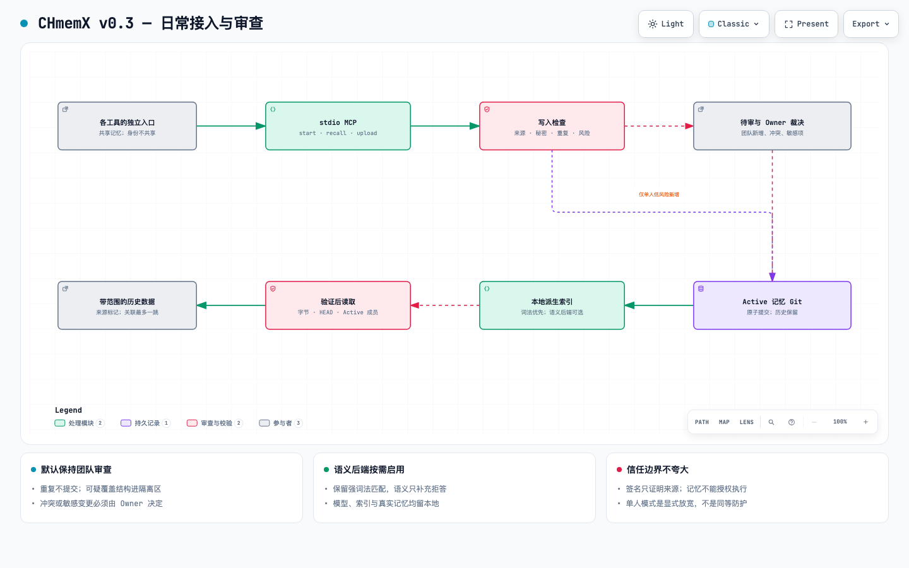

# CHmemX

[English](README.md) | **简体中文**

[](https://github.com/juliansoul250/CHmemX/actions/workflows/test.yml)
[](LICENSE)
[](pyproject.toml)

**面向多个 AI Agent 的本地优先、Git 管理、共享网状记忆系统。**

CHmemX 让 Codex、Claude Code、OpenCode、Pi、ZCode 等工具拥有各自的上传入口，同时读取同一个经过整理的内容型记忆项目。

默认团队模式下，来源 Agent 查询已生效记忆，并上传待整理内容。策展者负责来源校验、秘密扫描、去重、冲突比较和归类。Owner 精确确认批次后，整批内容才提交到 Git。

> **重要边界：** GitHub 上的 CHmemX 仓库只包含脱敏后的工具代码、Skill、Schema、文档、测试和虚构示例。你的真实记忆保存在另外指定的本地 `MEMORY_GRAPH_HOME` Git 仓库中，不会因为更新或推送 CHmemX 而自动上传。

> CHmemX 用于减少正常工作流程中的误写、重复和记忆冲突。它不是抵抗同一操作系统用户下恶意进程的安全边界。

## v0.5.3：接入与使用

现在可以通过 stdio MCP 调用 `start`、`recall`、`upload`。默认不需要端口、数据库服务、API Key 或向量模型。

```bash
python3 -m venv .venv
.venv/bin/python -m pip install 'git+https://github.com/juliansoul250/CHmemX.git@v0.5.3'
.venv/bin/chmemx --store /absolute/private-memory --cwd /absolute/git-project \
  --agent-id codex-main init --project-id project-demo
```

项目目录必须是现有 Git 根；记忆目录使用新建的独立位置。然后添加 [MCP 客户端配置](docs/zh-CN/mcp.md)。任务开始查记忆，结束上传；批准后的索引重建由入口处理。

### 选择写入政策

| 决策 | Team（默认） | Personal（显式 `init --mode personal`） |
|---|---|---|
| 谁准备记忆？ | 来源 Agent 上传 Pending，策展者审查。 | 保留上传检查；仅配置过的来源可自动保存。 |
| 什么可以自动保存？ | 不自动新增 Active。 | 低风险 `preference.*` 偏好新增项；默认按摘要确定的 10% 样本仍需审查。 |
| 什么必须审查？ | 所有新增、替代批次，均需 Owner 精确确认。 | 冲突、替代、其他事实和高风险内容；进入审阅的批次同样需 Owner 精确确认。 |
| 精确重复 | 不新增 Active，也不产生 Git 提交。 | 相同。 |
| 证据与召回 | Git 保留审批历史；Pending、隔离内容不召回。 | 相同；自动写入也记录政策决策。 |
| 升级影响 | 保留原政策。 | 升级不会自动开启。 |

Personal 主动放宽了写入政策，适合个人日常偏好，不能代替 Team 审阅。Agent 名称表示流程来源；可选签名证明内容来自哪个密钥，不证明内容正确，也不提供操作系统级授权。两个模式都无法阻止拥有同一用户文件权限的恶意进程直接改仓库。

- [MCP 配置与参数](docs/zh-CN/mcp.md)
- [v0.5.3 身份检查与历史长正文修复](docs/zh-CN/v0.5.3.md)
- [v0.5.2 注册、审阅与来源有效性修复](docs/zh-CN/v0.5.2.md)
- [v0.5.1 恢复修复与升级说明](docs/zh-CN/v0.5.1.md)
- [v0.5 上传流程与升级说明](docs/zh-CN/v0.5.md)
- [队列维护与中断恢复](docs/zh-CN/maintenance.md)
- [修改判断、实现边界与测试结果](docs/zh-CN/v0.3.md)
- [可选本地语义检索](docs/semantic.md)
- [Backlog 优先级与验收标准](docs/zh-CN/backlog.md)

## 为什么需要 CHmemX？

每个 AI 工具各自保存记忆，很快会形成互不相通的孤岛。更换工具后，历史决策、研究结果和项目状态无法继续使用。如果允许所有工具直接写入同一个仓库，问题又会走向另一端：未经审查的内容、重复记录和相互矛盾的结论会混在一起。

CHmemX 将职责明确拆开：

- **来源 Agent**：读取共享 Active Memory，只上传自己产生的 Pending 包。
- **集中策展者**：校验、去重、对比、归类并提出写入建议。
- **Owner**：处理冲突，精确确认最终批次。
- **Git**：保存永久记录、审批证据、替代链和回滚历史。
- **向量指向器**：将自然语言主题路由到内容网格及其关联 Active 节点。

## 架构

[](docs/v03.html)

点击图片打开 [v0.3 中文交互图](docs/v03.html)。[早期完整团队流程图](docs/zh-CN/architecture.html)
保留作设计历史；流程见 [v0.5 说明](docs/zh-CN/v0.5.md)，最新修复见 [v0.5.3](docs/zh-CN/v0.5.3.md)。

## 核心特性

- 每个 `(project, scope, class, canonical key)` 只允许一个当前 Active 值。
- 全局偏好与各正式项目记忆使用明确、独立的 Scope。
- 来源工具身份只表示上传来源，不代表独占读取权。
- Upload、Candidate、Quarantine、Rejected 和未解决冲突永不参与召回。
- Owner 确认绑定 Batch ID、Digest、候选顺序、正文、来源和父 Git HEAD。
- 修正使用 `supersede`，回滚使用 `git revert`，不静默覆盖历史。
- 派生向量索引不保存记忆正文，并在绑定的 Git HEAD 过期时拒绝召回。
- 默认支持中英文离线路由，不下载神经网络嵌入模型。
- Runtime 仅依赖 Python 标准库和 Git。

## 高级团队流程（原有 CLI 继续支持）

以下命令使用旧版 v1/v2 指向器。新接入优先使用 MCP 或 `chmemx recall`，它们运行 v3 检索并检查项目来源是否仍有效。两套索引格式独立；运行旧版优化器不会优化 MCP 索引。

### 1. 任务开始：读取共享记忆

先执行范围化查询：

```bash
python3 "$MEMORY_GRAPH_KIT/runtime/simple_memory.py" \
  --cwd "$PWD" start --role main --query '3 到 8 个任务关键词'
```

再查询内容网格：

```bash
python3 "$MEMORY_GRAPH_KIT/scripts/vector_memory.py" recall \
  --index "$MEMORY_GRAPH_KIT/vector-index.json" \
  --cwd "$PWD" \
  --query '用自然语言描述当前主题'
```

只有 `authority=accepted` 且 `status=active` 的记录可以影响工作。当前项目源码和正式文档始终高于记忆。

### 2. 任务结束：来源 Agent 只上传 Pending 包

来源 Agent 按 Schema 生成一个 `memorygraph-agent-export-v1` JSON 文件：

```text
inbox/<agent-id>/<export-id>.json
```

随后只报告文件路径、条目数、拒绝数和 SHA-256，并停止。来源 Agent 不得执行 Assemble、Curate、Import、Review、Approve、Supersede、Revert，也不得直接修改真实记忆 Git 仓库。

### 3. 集中策展

策展者可以先做只读路由：

```bash
python3 "$MEMORY_GRAPH_KIT/scripts/vector_memory.py" route-upload \
  --index "$MEMORY_GRAPH_KIT/vector-index.json" \
  --export "inbox/<agent-id>/<export-id>.json"
```

再把同一 Scope、且最多属于一个项目根目录的上传包合并整理：

```bash
python3 "$MEMORY_GRAPH_KIT/scripts/curate_uploads.py" \
  --export "inbox/agent-a/export-a.json" \
  --export "inbox/agent-b/export-b.json" \
  --curator-agent-id main-memory-curator \
  --curation-id curation-example \
  --output "outbox/curation-example.inventory.json" \
  --report "outbox/curation-example.report.json"
```

整理报告会：

- 保留每个来源 Agent ID 和 Export ID；
- 合并字节级完全相同的候选，同时保留全部来源；
- 阻止同一 Canonical Identity 的不同值；
- 与当前 Active Memory 对比；
- 为冲突提供当前值、新值、来源、字段差异和统一正文 Diff；
- 标记需要人工判断的语义重叠；
- 全程不修改真实记忆仓库。

### 4. 处理冲突

策展者向 Owner 提供四种明确建议：

- 保留当前 Active；
- 用新内容替代当前 Active；
- 重写为一个合并后的候选；
- 保留不同 Canonical Key，并用关联节点连接。

冲突决策只允许准备最终候选，不等于批准写入。最终内容仍需进入新的审阅批次，并单独精确确认。

### 5. 导入、审阅和提交

```bash
python3 "$MEMORY_GRAPH_KIT/runtime/simple_memory.py" \
  --cwd "$PWD" import-pending \
  --inventory "outbox/curation-example.inventory.json" \
  --agent-id main-memory-curator --confirmed

python3 "$MEMORY_GRAPH_KIT/runtime/simple_memory.py" \
  --cwd "$PWD" batch-review --batch-id '<batch-id>'
```

Owner 必须准确回复：

```text
确认记忆批次 <batch-id> <exact-digest>
```

只有完成该确认后，策展者才可执行 `approve`。审批成功会生成一个原子 Git 提交；任何部分失败都不能半提交。

### 6. 重建派生向量索引

```bash
python3 "$MEMORY_GRAPH_KIT/scripts/vector_memory.py" build \
  --store "$MEMORY_GRAPH_HOME" \
  --taxonomy "$MEMORY_GRAPH_KIT/examples/content-directory.example.json" \
  --output "$MEMORY_GRAPH_KIT/vector-index.json" --replace
```

## 旧版运行时初始化

要求：

- Python 3.10+
- Git

```bash
git clone https://github.com/juliansoul250/CHmemX.git
cd CHmemX

export MEMORY_GRAPH_KIT="$PWD"
export MEMORY_GRAPH_HOME="$HOME/.memory-graph/store"

python3 runtime/simple_memory.py init \
  --project-root /path/to/first/git/project \
  --project-id project-example \
  --title "Example Project" \
  --confirmed
```

初始化会创建一个独立的本地 Git 记忆仓库，不会修改来源项目。运行前必须确定真实存储路径和第一个注册项目。

更完整步骤见[中文快速开始](docs/zh-CN/quickstart.md)。

## 检索引擎与索引格式

| 入口 | 检索方式 | 评测边界 |
|---|---|---|
| MCP `start` / `recall`、CLI `chmemx recall` | `retrieval_v3.py`：BM25 与稀疏词法排序；可选本地 ONNX 嵌入，保守融合。 | v3 回归与保留测试集，检查当前项目来源。 |
| `scripts/vector_memory.py` | 旧版 v1/v2 哈希词法稀疏向量、余弦评分与图路由。 | 旧版黄金查询及自动 Active 覆盖；不包含 v3 来源新鲜度检查。 |

这里的“向量”指真实的稀疏向量表示，不代表每个后端都用了神经网络，也不代表运行了向量数据库。默认不下载模型；[可选 ONNX 后端](docs/semantic.md)通过 v3 使用，不由旧脚本开启。

### 旧版指向器细节

v1/v2 向量器完全离线且可复现：

- NFKC 规范化与大小写折叠；
- 英文单词 Token 与中文 2/3 字符片段；
- SHA-256 特征哈希生成稀疏向量；
- 根据全部 accepted + Active 记忆重新计算语料自适应 IDF；
- 为每条记录建立独立向量，避免共享节点导致同分误召回；
- 使用余弦相似度匹配内容单元与路由节点；
- 沿图关系扩展一跳；
- 在有限评分参数中自动择优，并使用动态分数阈值。

现有 v1/v2 安装可继续维护脱敏黄金查询，并通过旧版质量门禁发布索引：

```bash
python3 "$MEMORY_GRAPH_KIT/scripts/vector_memory.py" optimize \
  --store "$MEMORY_GRAPH_HOME" \
  --taxonomy /path/to/content-directory.json \
  --suite /path/to/recall-evaluation.json \
  --output /path/to/vector-index.json \
  --report /path/to/recall-quality-report.json \
  --replace
```

优化器只在三套受限、确定性的评分参数中择优。黄金查询和自动生成的 Active 覆盖检查全部通过后才发布；不会收集真实任务查询日志。
它调整词法评分，不训练嵌入模型。文件名、命令和 v1/v2 格式保持兼容；不要把 v3 索引传给旧脚本。
黄金查询格式见 [`examples/recall-evaluation.example.json`](examples/recall-evaluation.example.json)。

## 仓库结构

```text
runtime/simple_memory.py             真实记忆 Git 的唯一运行时接口
scripts/assemble_inventory.py        校验单个来源上传包
scripts/curate_uploads.py            去重并与当前 Active 对比
scripts/vector_memory.py             旧版 v1/v2 词法向量指向器
scripts/retrieval_v3.py               当前 MCP/CLI 检索
schemas/agent-export-v1.schema.json  来源上传包 Schema
schemas/recall-evaluation-v1.schema.json  召回质量黄金查询 Schema
skills/memory-graph/SKILL.md         可移植 Skill
examples/                            仅包含虚构上传包和内容网格模板
docs/zh-CN/                          简体中文文档
tests/                               仅使用合成数据的验收测试
```

## 中文文档

- [中文文档总目录](docs/zh-CN/README.md)
- [快速开始](docs/zh-CN/quickstart.md)
- [架构说明](docs/zh-CN/architecture.md)
- [集中策展与冲突处理](docs/zh-CN/curation.md)
- [命令参考](docs/zh-CN/command-reference.md)
- [工具接入规范](docs/zh-CN/tool-adapters.md)
- [本地存储、迁移与备份](docs/zh-CN/storage-and-backup.md)
- [安全与隐私](docs/zh-CN/security.md)
- [中文交互式架构图](docs/zh-CN/architecture.html)

## 本地存储与备份边界

CHmemX 工具仓库与真实记忆仓库是两个不同的 Git 仓库：

- `MEMORY_GRAPH_KIT`：CHmemX 工具代码，可以公开同步和更新。
- `MEMORY_GRAPH_HOME`：包含真实 Active Memory、审批记录和历史，默认纯本地。
- `inbox/`：各来源 Agent 的待整理上传区，不是 Active Memory。

本地 Git 可以恢复误写，但不能防止整块硬盘损坏。只有单独配置并验证外部备份或私有远程仓库，才能提供磁盘损坏保护。CHmemX 不会自动启用备份、远程同步或快照。

## 安全与隐私

不得在上传包或记忆中保存密码、Cookie、Token、私钥、完整聊天记录、隐藏运行时状态或个人敏感数据。来源工具私有目录保持隔离；策展者只读取共享上传包和真实记忆仓库。

Agent ID 只用于流程归属，不是经过身份验证的安全主体。同一系统用户下的恶意进程可以冒充 Agent ID；如需抵抗该威胁，必须另外增加操作系统级隔离。

参见[安全政策](SECURITY.zh-CN.md)和[安全与隐私说明](docs/zh-CN/security.md)。

## 测试

```bash
python3 tests/test_assemble_inventory.py
python3 tests/test_curate_uploads.py
python3 tests/test_vector_memory.py
PYTHONPATH=runtime python3 tests/simple_memory_test.py
python3 tests/test_docs.py
```

测试覆盖来源校验、秘密隔离、Candidate 隔离、精确 Owner 确认、原子提交、Supersede、项目隔离、集中冲突审阅、过期向量索引和跨项目路由。文档测试还会检查双语入口、架构图资源和所有仓库内 Markdown 链接。

## 非目标

- 云端托管记忆服务；
- 加密秘密保险库；
- 自动裁决记忆冲突；
- 已认证的多用户授权系统；
- 取代项目源码、正式文档或数据库。

## 参与贡献

阅读[中文贡献指南](CONTRIBUTING.zh-CN.md)。新增测试必须只使用合成数据。

## 许可证

[MIT](LICENSE)
